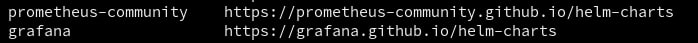
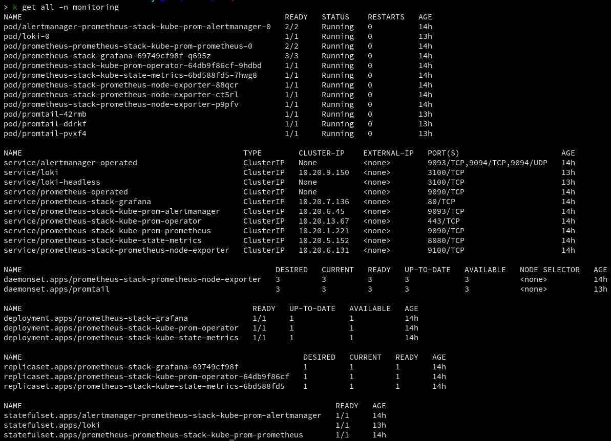

# ⚙️ Setup Kubernetes Monitoring using Helm 
## Prometheus, Grafana, Loki, Promtail 🔍

### We will use Helm chart to deploy [Prometheus Operator](https://bitnami.com/stack/prometheus-operator/helm), there will be all required components  `pod, deployment, replicaset, service, secret, configMap etc...`

### Make sure Helm is installed on your machine with required version  ✅

### Add required repo to your Helm by providing name to your repo

`helm repo add prometheus-community https://prometheus-community.github.io/helm-charts`

### As we need Loki && Promtail in our Cluster to get container logs, we have to add another repo

`helm repo add grafana https://grafana.github.io/helm-charts`

### Run `helm repo list` to view installed repo on your 💻 device
#### You have to get following output

## Now it is time to create all required components for monitoring 🎨

### 📌 Note that we are using seperate namespace for monitoring called `monitoring`

`kubectl create namespace monitoring`

`helm install prometheus-stack prometheus-community/kube-prometheus-stack --namespace monitoring`

### It will create all required components for Prometheus & Grafana as it used `prometheus-community` helm repository

### You can visualize installed Grafana pod by port-forwarding as you can configure Ingress too by having host-name

`kubectl port-forward svc/prometheus-stack-grafana 8888:80`
`username: admin` default
`password: prom-operator` default
#### You can expose whatever port you want instead of `8888` port but do not change port (80) which we are binding 🚫

## Install Loki & Promtail using garafana Helm repository that we installed 📎

`helm install loki grafana/loki -n monitoring`

`helm install promtail grafana/loki -n monitoring`

## Lists All Installed Component 🔥

### If you got the same results as above 📎
### You have done successfully 🎉 configuring your Kubernetes ⚓️ Monitoring using Helm 🎊